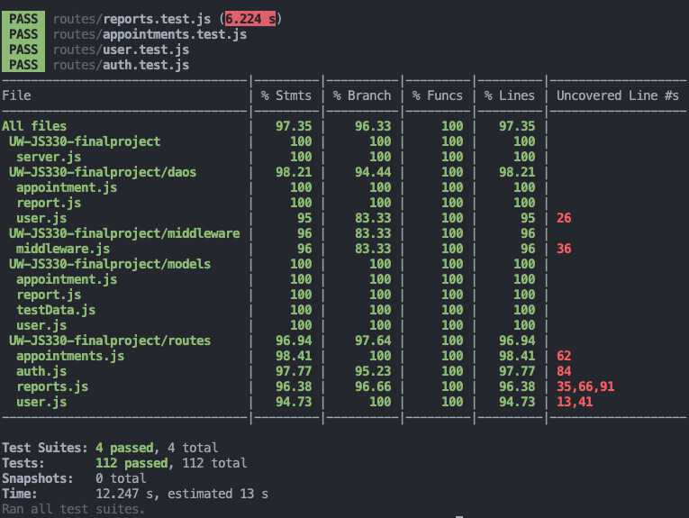

# 
 330 Final Project   Mental Health Behavioral Tracking 

## Table of contents

1. [Self-evaluation](#selfeval)
2. [Description of Scenario and Problem](#description)
3. [General Design](#generaldesign)
4. [Technical Components](#builtwith)
5. [Clear and direct call-outs](#callouts)
6. [Archive](#archive)
   1. [Timeline and Plan](#tasks)
   2. [Updates](#updates)

## 📝 Self-evaluation 

**🛠️ Approach and results:**

- **Designed and Implemented RESTful API Routes:** Designed and set up RESTful API routes for user and provider authentication, daily tracking, and appointment management. It resulted in a functional and well-organized API that meets the project's requirements.
- **Implemented Middleware Functions**: Appropriately implemented middleware functions helped to improve security and robustness in handling API requests. These include
  - Validation middleware for JWT tokens before granting access to protected routes.
  - Authorization middleware ensuring only authorized users can access sensitive endpoints.
  - Error handling to manage errors effectively.
- **Comprehensive Testing with Jest**: Creating comprehensive tests took quite some time but I was able to achieve high test coverage with Jest, making sure the API works well in different scenarios (e.g., provider vs user with a provider vs user without a provider).

**🎯 What Worked Well**:

- **Thorough Planning**: Planning and designing API routes and functionalities in the earlier weeks for our prototype/proof oc concept helped provide a clear structure. It required modifications along the way but the solid framework was beneficial.
- **Error Handling**: It was convenient and easy implementing error handling throughout the application to ensure that errors were caught and handled effectively.
- **Middleware Implementation**: Implementing middleware functions helped streamlined request handling. It helped that we had practice and the familiarity made it easy to identify potential middleware functions too. For example, one potential middleware function I plan to implement is varying the response for providers and users (i.e., `isProvider ? res.locals.userType = 'provider' :  res.locals.userType = 'user'`).

**🐛 What Didn't Work Well:**

- **Handling Edge Cases**: Had trouble with edge cases, especially since the routes were created prior to the tests. I ended up spending a lot of time writing comprehensive Jest tests before returning to my API routes to address them.
- **Managing Different Response Bodies**: Handling different response bodies and figuring out the appropriate response codes (e.g., `403`, `409`, or `404`, for when a user was trying to access another user's record) was tricky. I decided to create standardized response formats and error-handling middleware.
- **MongoDB vs. Mongoose Return Types**: I was unfamiliar and confused by the differences between MongoDB and Mongoose return types, such as arrays versus objects (e.g., `[{ mood: 2 }]` vs `{ mood: 2 }` vs `[ mood: 2 ]`). I also didn't know that chaining methods were not always applicable (e.g., `pretty()`, `lean()`). Finally, I had trouble with `$group` and using `$unwind` to return the output in the form of a data structure that I wanted. I chose to refactor the code for consistency but it led to data inconsistencies initially.

**💡 Lessons Learned:** Aside from learning how to build an API from scratch,

- **Test-Driven Development**: Learned the value of creating Jest tests first to guide the development process and catch issues early. This allows for more reliable and maintainable code, without requiring constant revisions.
- **Understanding MongoDB's Nature**: With familiarity in SQL, I had to adapt to MongoDB's data modeling and querying approaches. There were several data inconsistencies due to my initial schema set up. I also found it challenging to perform complex queries involving multiple collections, aggregations, or join (e..g, `$unionwith` and `$facets`).

**🚀 Improvements and Future Steps:**

- **_Code Quality and Structure:_**
  - **Code Refactoring:** Refactor code segments, especially in Jest tests, for better readability and maintainability.
  - **Modularization:** Breaking down and modularizing more code components for easier management and scalability.
    - **Create middleware:** Vary response for providers and users.
- **_Functionality Enhancements:_**
  - **Edge Cases:** There are potential edge cases to be addressed (e.g., patients with two providers).
  - **Add other fields for schema:** DOB, Time for appointments, returning name and user information
- **_User Experience:_**
  - **Front-end forms:** It would be nice to add more front-end forms to the API for improved user interaction.
  - **Form validation:** Password and email validation is incomplete.
- **_Data Analysis and Visualization:_**
  - **Creating chart:** Since the API focuses on identifying patterns, it would helpful to create charts for visual aid.
  - **Advanced Analytics:** Integrate advanced analytics to provide deeper insights into user data.
- **_Security:_**
  - **HIPAA Compliance:** Ensure that the API complies with HIPAA regulations to protect patient data and maintain privacy standards.

## Description of Scenario and Problem 

**Scenario your project is operating in.**

- This project/API operates within the healthtech sector, catering to both therapy users and individuals managing their mental health independently.
- Its goal is to allow users to track their mental well-being offline, facilitating the identification of patterns.

**What problem your project seeks to solve.**

- One challenge in therapy is the gap between sessions, where users struggle to recall and discuss pertinent events from the past week(s).
- This project hopes to address this by enabling users to engage in brief daily records, not only aiding in recall but also helps users identify triggers and patterns.
- Healthcare providers can then leverage this data to offer targeted insights during sessions.

## General Design 

The API utilizes MongoDB collections to manage user and provider functionalities.

- Users and physicians can sign up, login, and logout using dedicated routes, with authentication required for accessing other API endpoints.
- Authorization features ensure that healthcare providers have access to their patients/users' data, including the ability to update and delete appointments.
- Aside from login, other API endpoints include
  - **User Route:** Users can change their passwords and provider (if any).
  - **Behavioral Tracking Reports Route:** Users can post, update, get, and delete their daily behavioral tracking reports. Healthcare providers have access to all reports from their patients/users.
  - **Appointment Route:** Users can post and get their appointments, while only healthcare providers can update or delete appointments. Providers can also retrieve all appointments for their patients/users.
- Other features include:
  - Text search in Behavioral Tracking Reports
  - Aggregated statistics of mood ratings in Behavioral Tracking Reports
  - Lookups from user information when displaying reports and appointments

## Technical Components 

### Requirements

- #### Linux / Mac OS / Windows
  - [MongobDB](https://www.mongodb.com/docs/manual/tutorial/install-mongodb-on-os-x/)
  - [Node.js](https://nodejs.org/en/download/package-manager/)
- #### Dependencies
  - Express
  - Mongoose
  - Jest for tests
  - bcrypt for password hashing
  - jsonwebtoken for password tokens

### Installation Instructions

- `npm install`

### Models

- **Users:** Name (required), Email (unique, required), Password (required),  roles [Patient-user/ Provider] (required), Provider’s userId
  - Assume each user has only one Healthcare Provider assigned for now
- **Behavior Tracking Report:** userId (required, ref: users), Name, Email, Date (required), Mood rating (required), Inattentiveness rating (required), Hyperactivity rating (required), Impulsitivity rating (required), Journal Entry, Medication reactions, Provider's userId (ref: users)
  - Index for text search
- **Appointment management:** userId (required, ref: users), Date (required), Name, Email, Provider's userId (required, ref: users)

## DAOs

### User

| Method                                   | Description                         |
| ---------------------------------------- | ----------------------------------- |
| `signup(name, email, hash, roles)`       | Create a user record                |
| `getUser(email)`                         | Get a user record using their email |
| `getUsersOfProvider(userId, patientId)`  | Get all user records of a provider  |
| `updateUserPassword(userId, password)`   | Update the user's password field    |
| `updateUserProvider(userId, providerId)` | Update user’s healthcare provider   |

### Report

| Method             			 | Description      											|
| ------------------------ |--------------------------------------- |
| `createReport(userId, reportObj)`                         | Create a behavioral report for the given user                                                                           |
| `getReportById(userId, reportId, isProvider)`             | Get specific behavioral report for the given user/provider                                                              |
| `getReports(userId isProvider)`                           | Get all behavioral reports for the given user/provider                                                                  |
| `getReportsBySearchTerm(userId, searchTerms, isProvider)` | Get all behavioral reports based on search terms for the given user/provider                                            |
| `getReportStats(userId, isProvider)`                      | Get stats for mood ratings and symptom tracking from all behavioral reports for user or all patient-users of a provider |
| `getReportStatsByUserId(providerId, userId)`              | Get stats for mood ratings and symptom tracking from all behavioral reports of a specific user for a provider           |
| `updatedReportById(userId, reportId, updatedObj)`         | Update specific behavioral report for the given user                                                                    |
| `deleteReportById(userId, reportId)`                      | Delete specific behavioral report for the given user                                                                    |

### Appointment

| Method                                           | Description                                                           |
| ------------------------------------------------ | --------------------------------------------------------------------- |
| `createAppt(userId, date, providerId)`           | Create new appointments for given user                                |
| `getAppointments(userId, isProvider)`            | Get appointments for a given user/provider                            |
| `getAppointmentById(appointmentId, userId, isProvider)`         | Get specific appointment for a given user/provider                    |
| `updateAppointment(userId, providerId, date)` | Update specific appointment of a given user for a healthcare provider |
| `cancelAppointment(userId, providerId)`          | Delete specific appointment of a given user/provider                  |

## Clear and direct call-outs

### 1. Authentication & Authorization in Middleware

- Authentication: Check if the user has a valid jwt token during login, else return 401 error.
- Authorization: Verify if the user is a Healthcare Provider, else return 403 forbidden error.
- Error handling: Verify if given Id is a valid ObjectId, else return 500 error.

### 2. Indexes for performance and uniqueness when reasonable

- User:  
	- Unique field for email
- Behavioral Tracking Reports: 
	- Index for text search
	- Index for providers

### 3. At least one of text search, aggregations, and lookups

- Text search in Behavioral Tracking Reports
- Aggregated statistics of mood ratings in Behavioral Tracking Reports
- Lookups from user information when displaying reports and appointments

### 4. CRUD Routes

| Endpoint                   | Description                                                                                                                                                                                                                                                           |
| -------------------------- | --------------------------------------------------------------------------------------------------------------------------------------------------------------------------------------------------------------------------------------------------------------------- |
| **Signup and Login**       |                                                                                                                                                                                                                                                                       |
| `POST /auth/signup`        | Store user with their name, username, email, and encrypted password.                                                                                                                                                                                                  |
| `POST /auth/login`         | Find the user with the provided email/username. Use bcrypt to compare stored password with the incoming password. If they match, generate a JWT token.                                                                                                                |
| `PUT /auth/password`       | If the user is logged in, store the incoming password using their userId.                                                                                                                                                                                             |
| `POST /auth/logout`        | Should return 400                                                                                                                                                                                                                                                     |
| **Users**                  | ***Requires authentication***                                                                                 |
| `GET /users`               | *(Requires Authorization)* Returns array of all users (if Healthcare Providers)                                                                                                                                                                                       |
| `GET /users/:id`           | Returns user information with provided id                                                                                                                                                                                                 |
| `PUT /users/:id/provider`  | Update user’s provider ID.                                                                                                                                                                                                                |
| **Reports**                | ***Requires authentication***                                                                                        |
| `POST /reports`            | Store report along with their userId.                                                                                                                                                                                                     |
| `GET /reports`             | Returns all reports for their userId. If Healthcare Provider, should get array of logs from all patients/users                                                                                                                            |
| `GET /reports/stats`       | Returns an aggregated stats of mood rating and symptom tracking. If Healthcare Provider, should get array of reports of aggregated stats from all patients/users. If userId is in search params, Healthcare Providers should get an stats of userId |
| `GET /reports/search`      | Returns reports with that search term. If Healthcare Provider, should get array of reports with that search term from all patients/users                                                                                                  |
| `GET /reports/:id`         | Returns the report with the provided id and that has their userId. If Healthcare Provider, should get specified report.                                                                                                                   |
| `PUT /reports/:id`         | Updates the report with the provided id and that has their userId                                                                                                                                                                         |
| `DELETE /reports/:id`      | Deletes report with provided id from specified user.                                                                                                                                                                                      |
| **Appointments**           | ***Requires authentication***                                                                                       |
| `POST /appointments`       | *(Requires authorization)* Healthcare Providers can create and store the appointment. information                                                                                                                                                                      |
| `GET /appointments`        | Returns all appointments for their userId. If Healthcare Provider, should get array of appointments from all patients/users.                                                                                                               |
| `GET /appointments/:id`    | Returns the appointment with the provided id and that has their userId. If Healthcare Provider, should get specified appointment.                                                                                                         |
| `PUT /appointments/:id`    | *(Requires authorization)* Healthcare Providers can update the appointment with the appointment id, patient-user id, and own userId             |
| `DELETE /appointments/:id` | *(Requires authorization)* Healthcare Providers can delete appointment with the appointment id, patient-user id, and own userId             |

### 5. Jest tests:

- Authentication, authorization, error handling, CRUD operations for Auth, Users, Appointments, and Reports

<h2><a name="archive">Archive</a></h2>

## Timeline + Plan 

### Completed

<b>Week 6</b>

- [x] Create package.json
- [x] Create models for users, logs, notes
- [x] Create DAO for user
  - [x] **createUser(userObj)**
  - [x] **getUser(email)**
  - [x] **updateUserPassword(userId, password)**
  - [x] **updateUserProvider(userId, providerId)**
- [x] Create DAO for reports
  - [x] **createReport(userId, reportObj)**
  - [x] **getReport(userId, reportId)**
  - [x] **getUserReports(userId)**
  - [x] **getUserReportsBySearch(userId, searchTerms)**
  - [x] **getUserReportStats(userId)**
    - [x] **updateReportById(userId, apptObj)**
    - [x] **deleteReportById(userId, apptObj)**
- [x] Create routes for Login/Auth
  - [x] `POST /auth/signup`, `POST /auth/login`, `POST /auth/logout`
  - [x] `PUT /auth/password`
- [x] Create Middleware for **isAuthenticated**, **IsAuthorized**
- [x] Create route for Users - [x] `GET /users`, `GET /users/:id` - [x] `PUT /users/:id/provider`

<b>Week 7</b>

- [x] Create route for Logs (requires authentication)
  - [x] `POST /reports`
  - [x] `GET /reports`, `GET /reports/:id`, `GET /reports/stats`, `GET /reports/search`
  - [x] `PUT /reports/:id`
  - [x] `DELETE /reports/:id`
- [x] Create DAO for appointments:
  - [x] **createAppt(userId, apptObj)**
  - [x] **getAppt(userId, apptObj)**
  - [x] **updateAppt(userId, apptObj)**
  - [x] **deleteAppt(userId, apptObj)**
- [x] Create route for appointments (requires authentication) 
- [x] `POST /appointments` 
- [x] `GET /appointments`, `GET /appointments/:id` 
- [x] `PUT /appointments/:id` 
- [x] `DELETE /appointments/:id`

<b>Week 8</b>

- [x] (New addition) Review Jest tests setup
- [x] (New addition) Review Jest tests utils
- [x] Create Jest tests for authorization and authentication
- [x] Create Jest tests for user route
- [x] Create Jest tests for records route
- [x] Create Jest tests for appointment route
- [x] Test routes
- [x] Revise routes/daos/models 
- [x] (New addition) Error handling for id
- [x] (New addition) Review with Date issues, isProvider, edge cases 

<b>Week 9</b>

- [x] Create demo 
- [x] Complete README
- [x] Complete self-eval
- [x] Create frontend forms (TBD/Nice to have)

## Updates 

### Working on [see [timeline](#tasks) for breakdown]:

- Create Demo
- Practice Demo
- Self-eval in README
- Create middleware for patient is not providers'

### Completed:

- Express server
- Mongo connection
- Model schemas for user, appointment, and reports
- DAO methods for user, appointment, and reports
- CRUD routes for auth, user, appointments, and reports
- Middleware for authorization and authentication
- Revision of routes
- Creating demo collection for presentation and testing routes on Postman (40% complete; left with appointments and report routes)
- Create Jest tests for all routes
- Review test utils for Jest test
- Simplify jest tests
- Add match object to jest tests
- Create frontend forms (TBD/Nice to have)

